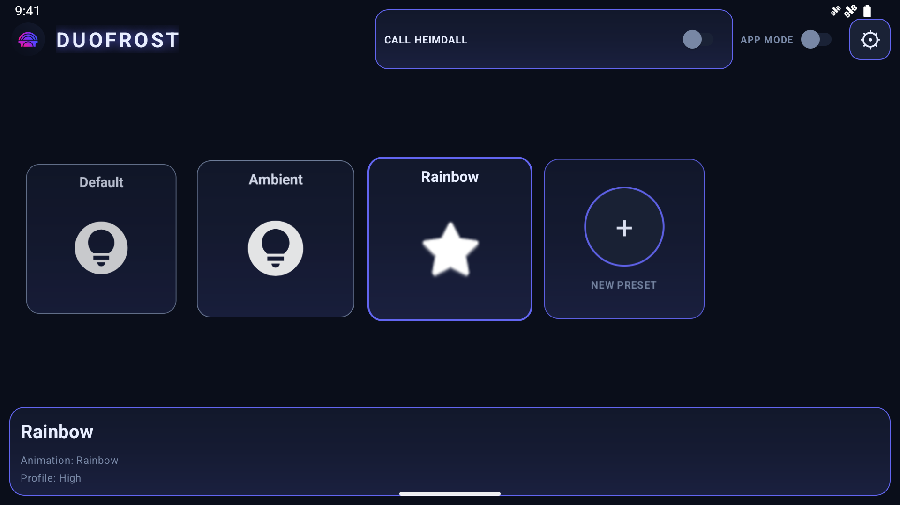
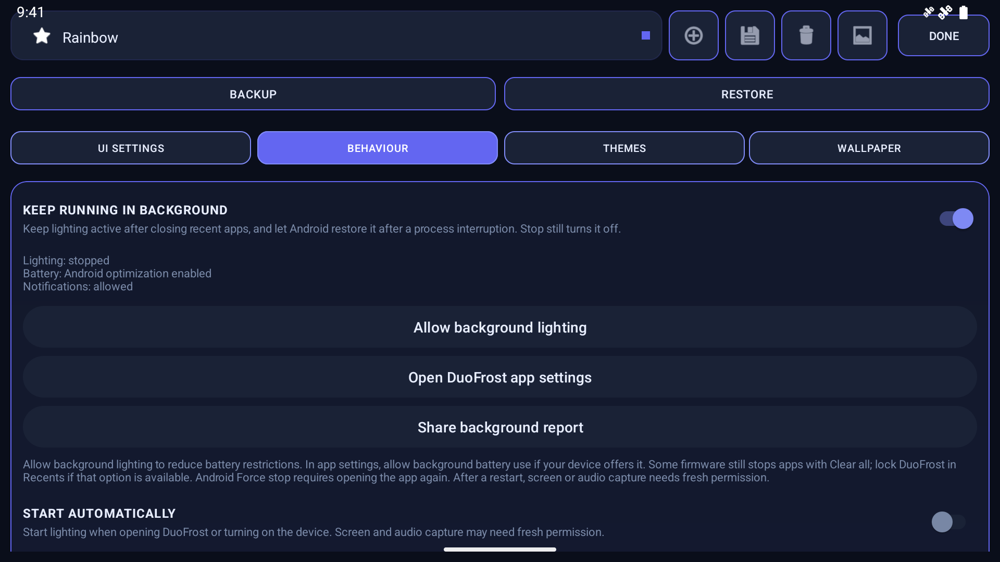
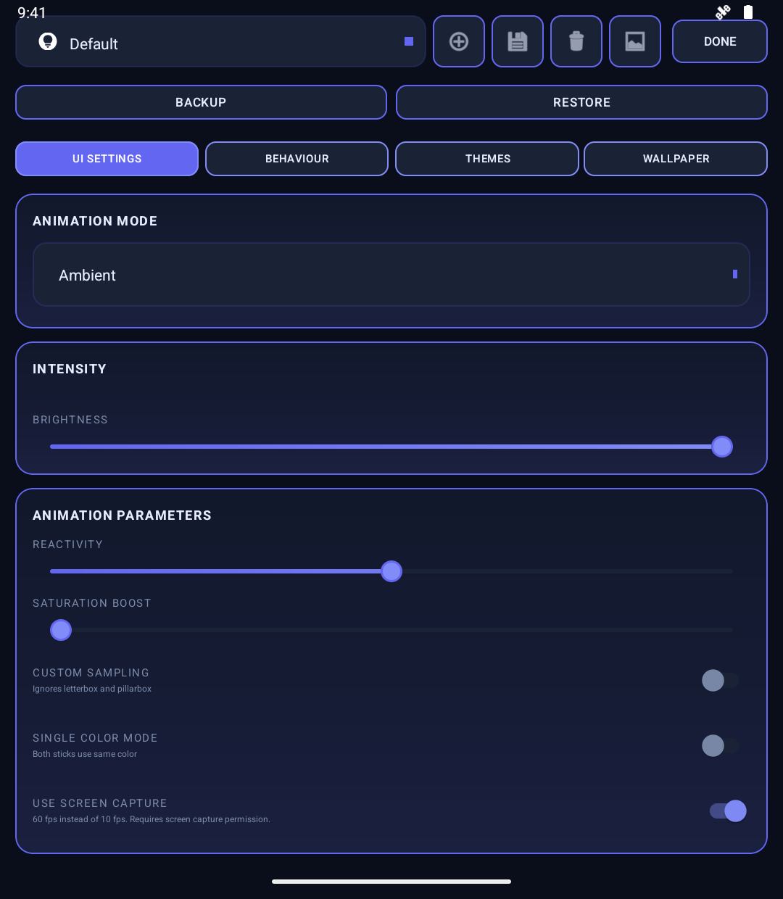

# DuoFrost

**Make your AYN device's lighting your own.**

DuoFrost brings screen-matching colors, audio-reactive lighting and custom LED effects to AYN devices, with practical controls for everyday use. Set your favorite look, keep it running in the background, dim it when you need to, or let a sleep timer turn it off.

An independent, open-source continuation of [BiFrost](https://github.com/Pollux-MoonBench/Bifrost), maintained by **Stefan van Den Broek (Tufein)**. The maintainer's device is **AYN Thor**.

**[Download Version 2 — stable](https://github.com/Tufein/DuoFrost/releases/download/v2/DuoFrost-2.apk)** · **[Try 2.1.0 — pre-release](https://github.com/Tufein/DuoFrost/releases/download/v2.1.0/DuoFrost-2.1.0.apk)** · [Report a problem](https://github.com/Tufein/DuoFrost/issues)

**Trying 2.1.0 from an older DuoFrost version? A one-time reinstall is required.** Export a full backup from the old app and save it outside the app **before uninstalling**. Then uninstall the old DuoFrost, install 2.1.0, import your backup and grant the permissions you need again. Keep your backup until you have checked the restore.

More screenshots

*App interface captured in an Android emulator; sample presets shown.*

## Your lighting, your way

DuoFrost keeps BiFrost's ambient screen colors, audio-reactive effects, Ambi Aurora, separate left/right controls, presets and app profiles. It also retains theme and backup sharing, charging/battery indicators and temperature effects.

### What DuoFrost adds

- **Better background control:** keep lighting running after closing the app or using Clear all, with recovery controls when Android interrupts it.
- **Brightness limits:** choose a maximum output, a Battery Saver limit and optional dimming when the screen is off.
- **Sleep timer and temporary mute:** use a timer quick choice or silence the LEDs while keeping the current effect ready to resume. The 2.1.0 pre-release adds custom durations from 1 to 120 minutes.
- **Home-screen widgets:** Start/Stop, mute/unmute and a favorite preset without navigating through settings.
- **More flexible schedules:** choose weekdays or weekends, including schedules that continue overnight.
- **Small everyday conveniences:** an easier Quick Settings tile setup, a six-step LED test, and separate backup of lighting and background settings.
- **Ambient fixes:** more faithful purple/pink colors, improved custom single-color sampling and more reliable capture cleanup.
- **Audio and sharing fixes in 2.1.0 pre-release:** audio effects stop cleanly after capture errors and use fewer hardware calls. Safer preset imports, better detection of unsaved custom colors and clear export failures help protect your presets.

## Get started

1. If you already use DuoFrost and want to try 2.1.0, follow the backup and reinstall instructions above first.
2. Download the APK from [Version 2 (stable)](https://github.com/Tufein/DuoFrost/releases/tag/v2), or choose the [2.1.0 pre-release](https://github.com/Tufein/DuoFrost/releases/tag/v2.1.0) to try the fixes.
3. Open it on your AYN device and follow the first-run guide.
4. Pick an effect, adjust your colors and brightness, and enable only the permissions you need.

For updates through Obtainium, add [this repository](https://github.com/Tufein/DuoFrost).

Coming from BiFrost? DuoFrost installs alongside it. Export your presets, themes or backup from BiFrost, then import them into DuoFrost. Run one LED controller at a time.

Ambient and audio effects need capture permission. These effects process samples locally and do not record or upload captured content. For background lighting, allow DuoFrost to run in the background in Android's battery settings. After an Android Force stop, open the app again.

## Releases

- **[2.1.0 fix update — pre-release](https://github.com/Tufein/DuoFrost/releases/tag/v2.1.0):** audio stability, safer preset imports, custom sleep timers and clearer export failures, building on Version 2.
- **[Version 2](https://github.com/Tufein/DuoFrost/releases/tag/v2):** the original release with widgets, timer quick choices, mute, brightness limits, scheduling and background controls. Its original signed APK retains Android version 1.5.1.
- **[Version 1](https://github.com/Tufein/DuoFrost/releases/tag/v1.0.0):** the first DuoFrost release, focused on ambient color accuracy and capture stability.

See the [changelog](CHANGELOG.md) for details and [technical.md](technical.md) for build instructions, implementation notes and Android behavior.

## Open source and credits

DuoFrost is based on BiFrost by **Pollux / Pollux-MoonBench**, with contributions from **KuriGohan-Kamehameha**, **paradox**, **hupo224** and the upstream community. Original authorship and Git history are preserved; see [credits](CREDITS.md).

Source and releases are available under [GPLv3](LICENSE). Forks and contributions are welcome. DuoFrost is not affiliated with AYN.
