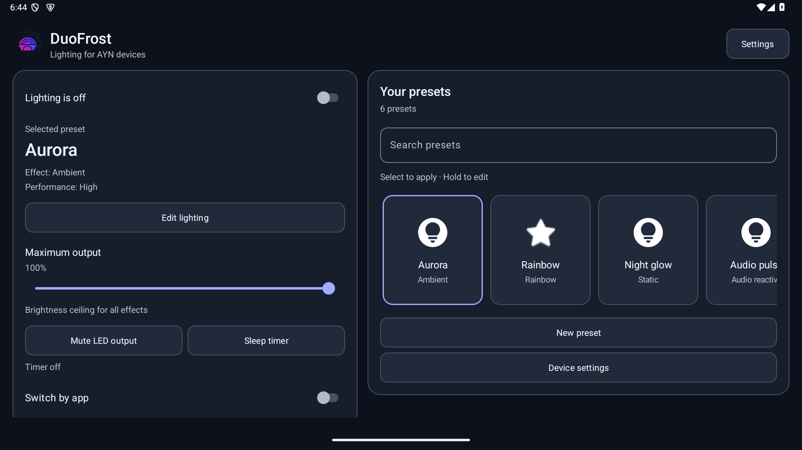
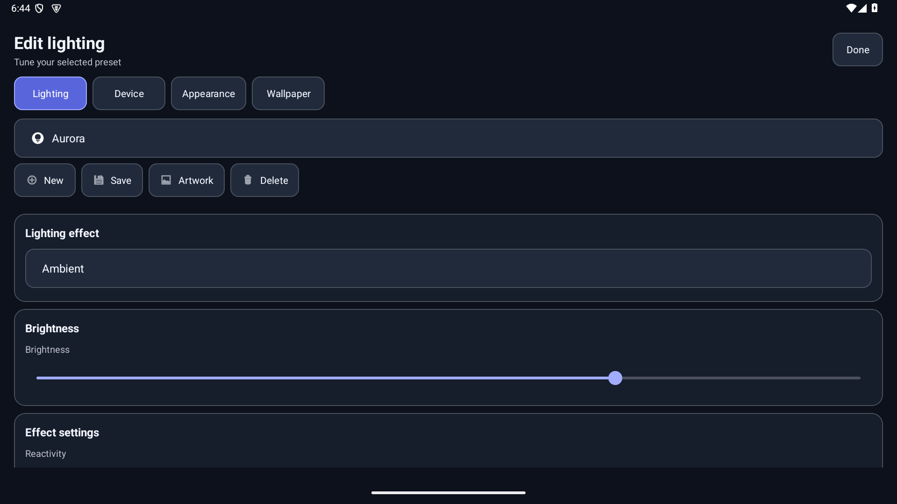
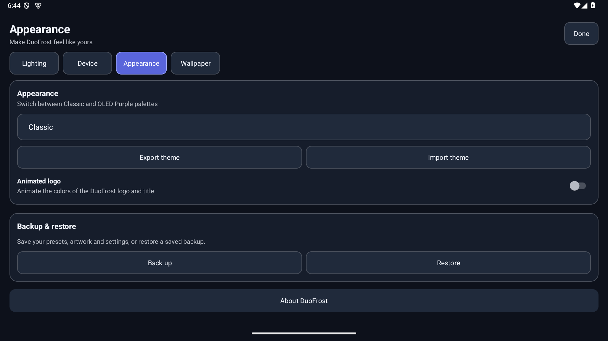
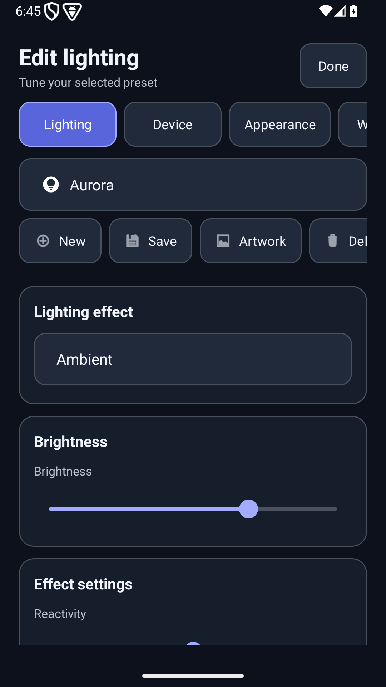
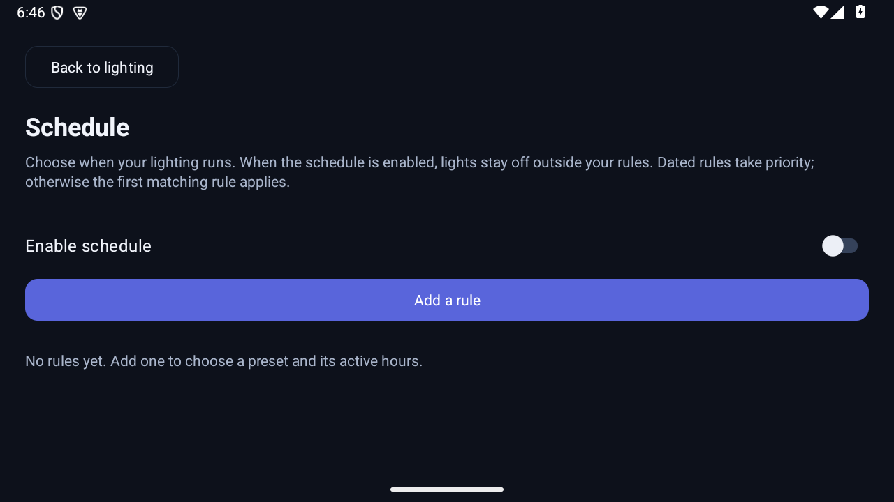

# DuoFrost 2.3.0 interface refresh

This build focuses on making existing lighting controls easier to find and use.
The public 2.1.0 release and the original Version 1 and Version 2 remain available.

## What changed

- A home dashboard shows lighting status and the selected preset, with direct access to maximum output, mute, the sleep timer and capture recovery.
- Presets have flat, readable cards with visible selection and keyboard focus. Browsing never changes lighting; in manual mode, a click applies a preset and a hold opens its editor.
- Local search finds presets by name or effect, preserving their storage indices. Filtering cannot change the selected preset or saved lighting.
- The editor has four clear destinations: Lighting, Device, Appearance and Wallpaper. Larger text and controls replace dense uppercase labels and tiny toolbar icons.
- Preset tools scroll with the editor content, leaving more space on short screens. On wide windows, the dashboard and library sit side by side; narrow windows stack them.
- Onboarding, schedules, plugins, artwork, backup dialogs, color selection, credits and the LED test share calmer styling and visible navigation.
- Unsaved lighting edits, the selected editor destination and search survive activity recreation. Restoring the interface does not start lighting or reuse capture grants.
- The app window is hidden from recent apps. Use the launcher icon to reopen DuoFrost.

Existing presets, themes, app profiles, backups, widgets and lighting effects stay compatible. The dashboard uses the existing output, mute and timer commands; it adds no background polling.

## Preview

Actual captures from the signed 2.3.0 APK in an Android emulator, with sample presets.

Appearance, portrait layout and schedules

## Design choices and research

The design uses the existing Android Views and Material dependencies. Android recommends adapting a destination to window width while preserving navigation and state: [responsive Views guidance](https://developer.android.com/develop/ui/views/layout/build-responsive-navigation). The keyboard focus work follows [Android keyboard navigation guidance](https://developer.android.com/develop/ui/views/touch-and-input/keyboard-input/navigation). Preset search follows the familiar local-search pattern in [Material's Android search documentation](https://github.com/material-components/material-components-android/blob/master/docs/components/Search.md).

Default palette contrast is 15.32:1 for main text, 8.25:1 for secondary text, 4.87:1 for selected-tab text and 6.79:1 for the focus border. These measurements cover the default palette, not a full screen-reader certification. Controls target at least 48dp; color swatch text chooses black or white to suit its background.

## Installation and validation

The signed 2.3.0 APK uses the same private release certificate as 2.1.0. It can update 2.1.0 in place. For older installations, keep the existing one-time full-backup and reinstall procedure. 2.3.0 is published as a pre-release; 2.1.0 remains the latest stable release.

214 JVM tests passed for 2.3.0, including three layout tests for short landscape and portrait windows. The signed release build and critical release lint passed. Five Android instrumentation tests passed on an Android 15 emulator. Automated checks cover preset filtering and draft serialization, plus Android interactions for search and selection, destination visibility, output-limit synchronization, app-profile mode and saving edits after recreation. Manual checks covered narrow portrait and wide/short landscape windows, 200% font size, palette switching, schedules, plugins and the sleep-timer dialog. Screenshots show the real Android emulator interface with sample presets. Physical LED output and firmware-specific background behavior need device testing.
